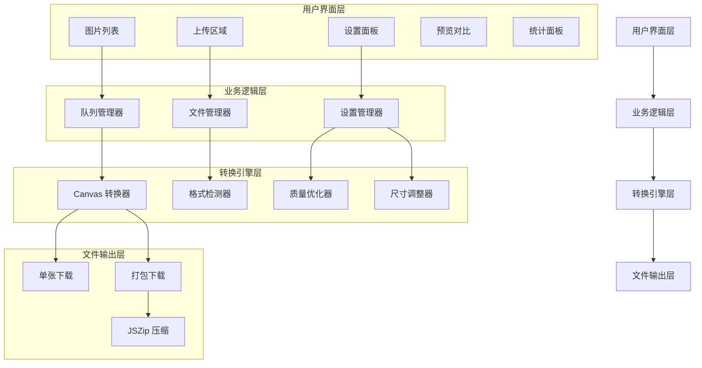

# Image to WebP Converter

Feature Name: image-to-webp-converter
Updated: 2026-05-09

## Description

一个纯前端实现的图片格式转换工具，支持 JPEG、PNG、GIF、BMP、TIFF、SVG、HEIC、RAW 等多种格式批量转换为 WebP 格式。提供质量调节、尺寸调整、预览对比、压缩统计等功能，既可作为独立网页应用使用，也可集成到 Hexo 博客中。

## Architecture



### 架构说明

1. **用户界面层**: 负责与用户交互，包括拖拽上传、图片展示、参数调节、预览对比等
2. **业务逻辑层**: 处理文件管理、转换队列、设置保存等核心业务逻辑
3. **转换引擎层**: 基于 Canvas API 实现图片格式转换、质量调节、尺寸调整
4. **文件输出层**: 处理转换后文件的下载，支持单张和批量打包下载

## Components and Interfaces

### 1. 文件上传组件 (FileUploader)

**职责**: 处理文件拖拽和选择，验证文件格式

**接口**:
```typescript
interface FileUploader {
  onFileSelect: (files: File[]) => void
  onFileRemove: (fileId: string) => void
  supportedFormats: string[]
}
```

**依赖**: HTML5 File API, Drag and Drop API

### 2. 图片预览组件 (ImagePreview)

**职责**: 显示图片缩略图和详细信息

**接口**:
```typescript
interface ImagePreview {
  render: (imageData: ImageData) => void
  update: (imageId: string, data: Partial<ImageData>) => void
  remove: (imageId: string) => void
}
```

### 3. 转换设置组件 (ConversionSettings)

**职责**: 管理转换参数（质量、尺寸）

**接口**:
```typescript
interface ConversionSettings {
  quality: number (0-100)
  width: number | null
  height: number | null
  maintainAspectRatio: boolean
  onUpdate: (settings: ConversionSettings) => void
}
```

### 4. 转换引擎 (ConverterEngine)

**职责**: 核心转换逻辑，使用 Canvas API

**接口**:
```typescript
interface ConverterEngine {
  convert: (file: File, settings: ConversionSettings) => Promise<ConversionResult>
  cancel: (taskId: string) => void
  cancelAll: () => void
}
```

**实现细节**:
```typescript
async convert(file: File, settings: ConversionSettings): Promise<ConversionResult> {
  const bitmap = await createImageBitmap(file)
  const canvas = document.createElement('canvas')
  
  // 计算目标尺寸
  const { width, height } = calculateDimensions(bitmap, settings)
  canvas.width = width
  canvas.height = height
  
  // 绘制并转换
  const ctx = canvas.getContext('2d')
  ctx.drawImage(bitmap, 0, 0, width, height)
  
  // 转换为 WebP
  const blob = await new Promise<Blob>((resolve) => {
    canvas.toBlob((blob) => resolve(blob), 'image/webp', settings.quality / 100)
  })
  
  return {
    originalSize: file.size,
    convertedSize: blob.size,
    compressionRate: (1 - blob.size / file.size) * 100,
    blob: blob,
    width: width,
    height: height
  }
}
```

### 5. 批量下载组件 (BatchDownloader)

**职责**: 打包多个文件并提供下载

**接口**:
```typescript
interface BatchDownloader {
  addFile: (blob: Blob, filename: string) => void
  downloadAll: (zipName: string) => Promise<void>
  clear: () => void
}
```

**依赖**: JSZip 库

### 6. 统计面板 (StatisticsPanel)

**职责**: 显示转换统计信息

**接口**:
```typescript
interface StatisticsPanel {
  updateStats: (stats: ConversionStats) => void
  reset: () => void
}

interface ConversionStats {
  totalFiles: number
  totalOriginalSize: number
  totalConvertedSize: number
  averageCompressionRate: number
}
```

## Data Models

### ImageData

```typescript
interface ImageData {
  id: string
  file: File
  name: string
  originalSize: number
  format: string
  width: number
  height: number
  previewUrl: string
  status: 'pending' | 'converting' | 'completed' | 'failed'
  convertedBlob?: Blob
  convertedSize?: number
  compressionRate?: number
  errorMessage?: string
}
```

### ConversionSettings

```typescript
interface ConversionSettings {
  quality: number              // 1-100
  targetWidth: number | null   // null 表示使用原始宽度
  targetHeight: number | null  // null 表示使用原始高度
  maintainAspectRatio: boolean // 是否保持宽高比
}
```

### ConversionResult

```typescript
interface ConversionResult {
  originalSize: number
  convertedSize: number
  compressionRate: number
  blob: Blob
  width: number
  height: number
  duration: number
}
```

### ConversionStats

```typescript
interface ConversionStats {
  totalFiles: number
  completedFiles: number
  failedFiles: number
  totalOriginalSize: number
  totalConvertedSize: number
  averageCompressionRate: number
  totalSaved: number
}
```

## Correctness Properties

### 不变量

1. **文件大小非负**: 所有文件大小值必须 >= 0
2. **压缩率范围**: 压缩率必须在 0-100 之间
3. **质量参数范围**: 质量设置必须在 1-100 之间
4. **尺寸正数**: 宽度和高度必须为正整数
5. **格式一致性**: 输出格式必须始终为 WebP

### 约束条件

1. **HEIC/RAW 支持**: HEIC 和 RAW 格式需要额外解码库（如 heic2any, raw-loader）
2. **浏览器兼容性**: 需要浏览器支持 Canvas API 和 toBlob WebP 格式
3. **内存限制**: 超大图片可能导致浏览器内存不足，需要分块处理或限制
4. **SVG 转换**: SVG 需要先栅格化再转换为 WebP

## Error Handling

### 错误场景和处理策略

1. **不支持的格式**
   - 显示友好的错误提示
   - 列出支持的格式列表
   - 建议用户使用在线转换工具预处理

2. **文件过大**
   - 检测文件大小，超过阈值时警告
   - 提供压缩选项或建议分批处理

3. **转换失败**
   - 记录失败原因（格式损坏、内存不足等）
   - 提供重试选项
   - 不影响其他文件的转换

4. **浏览器不支持 WebP**
   - 检测浏览器兼容性
   - 提供降级方案或提示用户更换浏览器

5. **下载失败**
   - 重试下载
   - 提供备用下载方式

### 错误码定义

```typescript
enum ConversionError {
  UNSUPPORTED_FORMAT = 'UNSUPPORTED_FORMAT',
  FILE_TOO_LARGE = 'FILE_TOO_LARGE',
  CONVERSION_FAILED = 'CONVERSION_FAILED',
  BROWSER_NOT_SUPPORTED = 'BROWSER_NOT_SUPPORTED',
  MEMORY_EXCEEDED = 'MEMORY_EXCEEDED',
  DOWNLOAD_FAILED = 'DOWNLOAD_FAILED'
}
```

## Test Strategy

### 单元测试

1. **格式检测测试**
   - 验证每种支持格式的正确识别
   - 验证不支持格式的拒绝处理

2. **转换功能测试**
   - 验证各格式到 WebP 的转换正确性
   - 验证质量参数的影响
   - 验证尺寸调整的正确性

3. **边界条件测试**
   - 空文件处理
   - 超大文件处理
   - 极端质量设置（1 和 100）
   - 零尺寸和超大尺寸设置

### 集成测试

1. **完整流程测试**
   - 上传 → 转换 → 下载的完整流程
   - 批量转换流程
   - 取消转换功能

2. **UI 交互测试**
   - 拖拽上传功能
   - 质量滑块调节
   - 尺寸输入验证
   - 预览对比显示

3. **性能测试**
   - 批量转换 10、50、100 张图片的性能
   - 大文件（10MB+）转换性能
   - 内存使用情况监控

### 兼容性测试

1. **浏览器测试**
   - Chrome、Firefox、Safari、Edge
   - 移动端浏览器（iOS Safari、Chrome Mobile）

2. **部署模式测试**
   - 本地开发环境
   - Hexo 博客集成
   - 独立静态部署

### 测试工具

- **Jest/Vitest**: 单元测试
- **Playwright**: E2E 测试
- **Lighthouse**: 性能和可访问性测试

## References

[^1]: (WebP Specification) - Google WebP 格式规范 https://developers.google.com/speed/webp
[^2]: (Canvas API) - MDN Canvas API 文档 https://developer.mozilla.org/en-US/docs/Web/API/Canvas_API
[^3]: (JSZip) - JSZip 库文档 https://stuk.github.io/jszip/
[^4]: (AnZhiYu Theme) - AnZhiYu Hexo 主题 https://github.com/anzhi-yu/anzhiyu-theme-hexo
